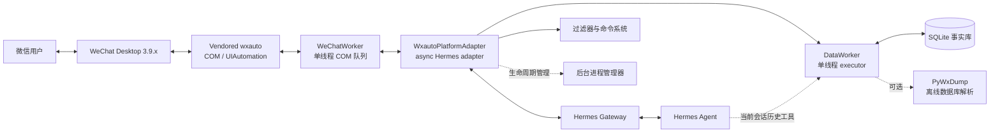

# wx-auto-platform

`wx-auto-platform` 是一个仅支持 Windows 的 [Hermes](https://github.com/NousResearch/hermes-agent) 平台插件。它通过 WeChat Desktop 的 COM/UIAutomation 接口，把微信私聊和群聊接入 Hermes Agent，同时提供消息过滤、管理员命令、文件发送、本地聊天事实库和历史消息查询能力。

```text
微信用户 ↔ 微信桌面端 ↔ wx-auto-platform ↔ Hermes Gateway ↔ Agent
```

## 功能

- 接收微信私聊和群聊消息，并转换为 Hermes `MessageEvent`
- 通过聊天表限制监听范围，支持发送人黑名单
- 发送纯文本和本地文件，自动移除微信无法渲染的 Markdown 标记
- 使用 `<file url="本地路径"/>` 在 Agent 回复中发送图片、音频、视频或其他文件
- 所有 wxauto/COM 调用固定在单一工作线程执行，避免阻塞 Hermes 异步事件循环
- 对发送类操作增加随机延迟，模拟自然操作节奏
- 使用最近消息 ID 滑动窗口避免重复投递
- 内置普通命令与基于“管理员名单 + TOTP”的管理命令
- 将实时消息持久化到 SQLite 本地事实库
- 可选启用 PyWxDump（仓库未提供），补充微信数据库中的离线消息和媒体文件
- 可选按安全时间窗对账在线捕获与微信数据库记录
- 向 Agent 注册当前会话的精确时间范围和最近历史消息查询工具
- 可随适配器生命周期守护附加后台进程，目前支持可选的 Camofox Browser
- 支持 Hermes cron 独立连接并向默认微信聊天投递消息

## 运行要求

- Windows 10/11 Only
- Python 3.10 或更高版本
- 微信桌面端 3.9.x，已登录并可正常打开目标聊天
- 已安装并可运行 Hermes
- 目标聊天名称在微信中可被准确识别

## 安装

将仓库放入 Hermes 插件目录：

```text
~/.hermes/plugins/wx-auto-platform/
```

在 PowerShell 中进入插件目录并安装依赖：

```powershell
python -m pip install -r requirements.txt
```

复制配置模板：

```powershell
Copy-Item config.example.yaml config.yaml
```

编辑 `config.yaml`，至少配置需要监听的聊天：

```yaml
chat_table:
  - id: 文件传输助手
    name: 文件传输助手
    type: self

  - id: Alice
    name: Alice
    type: friend

  - id: 项目讨论群
    name: 项目讨论群
    type: group

admins:
  - chat: "*"
    admin_name: YourName

blacklist: []

min_delay: 0.5
max_delay: 2.0
poll_interval: 0.5

data_manager:
  enabled: true
  database_path: data/messages.db
  timezone: Asia/Shanghai
  agent_names:
    - Levi
  reconciliation:
    enabled: false
    interval_seconds: 600
    overlap_seconds: 120
    settle_delay_seconds: 30
    time_tolerance_seconds: 5
  pywxdump:
    enabled: false
    wx_path: ""
    merge_path: data/pywxdump/merge_all.db
    media_cache_path: data/pywxdump/media
    page_size: 500
```

`chat_table[].id` 必须与微信界面中的聊天名称一致：

| `type` | 用途 |
|---|---|
| `friend` | 私聊 |
| `group` | 群聊 |
| `self` | 自己的会话，例如“文件传输助手” |

配置完成后保持微信桌面端登录，并重启 Hermes。存在 `config.yaml` 时插件会自动启用；也可以显式设置：

```powershell
$env:WX_AUTO_ENABLED = "true"
```

不要提交包含个人聊天名称、路径或敏感配置的 `config.yaml`。

## 环境变量

| 变量 | 说明 |
|---|---|
| `WX_AUTO_ENABLED` | 设为 `true`、`1` 或 `yes` 时显式启用插件 |
| `WX_AUTO_CONFIG_PATH` | 自定义 YAML 配置文件路径；默认使用插件根目录的 `config.yaml` |
| `WX_AUTO_ADMIN_TOTP_SECRET` | 管理员 TOTP Base32 共享密钥，优先于配置文件 |
| `WX_AUTO_HOME_CHANNEL` | Hermes cron 默认投递的微信聊天名 |
| `WX_AUTO_ALLOWED_USERS` | Hermes 平台层允许与 Agent 对话的用户显示名，逗号分隔 |
| `WX_AUTO_ALLOW_ALL_USERS` | 设为 `true` 时允许所有用户通过 Hermes 平台层校验；插件自身仍会执行聊天表和黑名单过滤 |
| `WX_AUTO_WECHAT_DB_KEY` | PyWxDump 使用的 64 位十六进制微信数据库密钥 |
| `WX_AUTO_CAMOFOX_PATH` | 可选的 Camofox Browser 项目目录，覆盖配置中的 `camofox_browser_path` |

推荐通过 Hermes 的环境配置或系统环境变量注入密钥，不要把 TOTP 密钥和微信数据库密钥写入仓库。

## 使用方法

### 接收消息

插件连接后会为 `chat_table` 中的聊天调用 `AddListenChat`，并按 `poll_interval` 轮询新消息。

消息进入 Agent 前依次执行：

1. 实时消息写入本地事实库（DataManager 启用时）。
2. 丢弃自己发送的 `self` 消息。
3. 丢弃命中黑名单的发送人。
4. 丢弃不在 `chat_table` 中的聊天。
5. 识别并处理 slash 命令。
6. 将普通消息组装为 Hermes `MessageEvent`。

因此，黑名单消息和命令可以保留在本地事实库中，但不会作为普通对话交给 Agent。

### 发送文本和文件

普通 Agent 回复会作为微信纯文本发送。Markdown 标题、粗体、链接等格式会被转换为更适合微信气泡的纯文本。

若要发送本地文件，在回复中使用：

```xml
这是文件：
<file url="C:\path\to\report.pdf"/>
```

路径必须指向本机已存在的文件。插件会按文本段和文件指令的顺序依次发送。微信单条文本的 Hermes 平台上限为 4000 字符。

### 微信命令

| 命令 | 权限 | 说明 |
|---|---|---|
| `/help` | 普通 | 显示可用命令 |
| `/statwx` | 普通 | 查看 worker 运行时长、监听聊天、延迟范围和去重状态 |
| `/procstat` | 普通 | 查看插件守护的后台进程状态 |
| `/parser_debug <内容>` | 普通 | 使用真实发送链路测试文本和文件指令解析 |
| `/restartwx <TOTP>` | 管理员 | 重建 wxauto 实例并恢复聊天监听 |
| `/ban <TOTP> <用户名>` | 管理员 | 将用户加入当前聊天的黑名单并写回配置 |

管理员命令要求：

1. 发送人的显示名命中 `admins`。
2. 第一个参数是由 `WX_AUTO_ADMIN_TOTP_SECRET` 生成的当前 6 位 TOTP。
3. 动态码未在短期防重放缓存中使用过。

示例：

```text
/ban 837461 Alice
```

微信群成员可能修改显示名，因此管理员名单不能单独作为可靠身份认证。请通过私密渠道分发 TOTP 密钥。

## 本地聊天事实库

DataManager 默认启用，数据库默认位于：

```text
data/messages.db
```

它会保存消息时间、聊天、发送人、方向、归一化类型、正文、本地文件路径、来源和对账状态等信息。SQLite 操作在独立的单线程 executor 中执行，不阻塞 Hermes 主事件循环。

插件同时向 Agent 注册两个工具：

- `search_wechat_chat_history`：按精确 ISO 8601 时间范围查询当前微信会话
- `search_recent_wechat_chat_history`：按分钟、小时或天数查询当前微信会话的最近消息

工具自动使用当前 Hermes 会话的聊天 ID，不允许 Agent 任意读取其他聊天。单次最多返回 200 条消息。

如不需要本地持久化和历史查询：

```yaml
data_manager:
  enabled: false
```

更完整的数据模型与对账设计见 [docs/data_manager.md](docs/data_manager.md)。

## 可选：微信数据库补账与对账

实时 UIAutomation 可能因 Hermes 停机、微信窗口状态或界面变化漏掉消息。PyWxDump 解析器可以读取微信本地数据库，将离线记录补充到事实库。

启用前配置账号目录：

```yaml
data_manager:
  pywxdump:
    enabled: true
    wx_path: 'C:\Users\name\Documents\WeChat Files\wxid_xxx'
```

再通过环境变量提供数据库密钥：

```powershell
$env:WX_AUTO_WECHAT_DB_KEY = "<64位十六进制密钥>"
```

可先运行真实数据库冒烟测试：

```powershell
python scripts/smoke_pywxdump_parser.py `
  --wx-path 'C:\Users\name\Documents\WeChat Files\wxid_xxx'
```

确认解析结果正常后，再按需启用 `data_manager.reconciliation.enabled`。对账会在重叠安全时间窗内匹配在线记录与数据库记录，以数据库时间和结构化字段校正在线推断；歧义记录会被保留，不会通过整段删除重建来“强行一致”。

## 技术架构



### 入站数据流

```text
GetListenMessage
    → 消息 ID 去重
    → DataManager.ingest_online
    → 黑名单 / 聊天表 / 命令过滤
    → MessageEvent
    → Hermes Gateway
    → Agent
```

### 出站数据流

```text
Agent 回复
    → 文本 / <file/> 指令解析
    → Markdown 清理
    → WeChatWorker.submit
    → ThrottledWeChat
    → SendMsg / SendFiles
```

### 线程模型

- Hermes adapter、轮询和生命周期管理运行在 asyncio 事件循环。
- `WeChatWorker` 持有唯一 `ThrottledWeChat` 实例，并在同一个已 `CoInitialize` 的线程中串行执行全部 COM/UIAutomation 调用。
- `DataWorker` 使用独立的单线程 executor 串行执行 SQLite、数据库解密和解析操作。
- `ThrottledWeChat` 保持同步 API，并在最外层发送 RPC 前执行随机阻塞延迟；该阻塞只发生在 COM worker 线程。

这种设计同时满足 COM 线程亲和性和 Hermes 的异步非阻塞要求。

## 项目结构

```text
.
├── adapter.py                  # Hermes 插件入口与平台适配器
├── PLUGIN.yaml                 # 插件元数据和环境变量声明
├── config.example.yaml         # 配置模板
├── src/
│   ├── config.py               # 配置加载、查询和持久化
│   ├── filters.py              # 入站消息过滤管线
│   ├── commands.py             # slash 命令、TOTP 和防重放
│   ├── directives.py           # <file/> 指令解析
│   ├── wechat_worker.py        # 单线程 COM/asyncio 桥接
│   ├── throttled_wechat.py     # wxauto 发送节流扩展
│   ├── background_*.py         # 后台进程注册与生命周期
│   ├── agent_tools/            # 当前会话历史查询工具
│   ├── data_manager/           # SQLite、离线解析与对账
│   └── wxauto_plugin/          # vendored 第三方代码，请勿直接修改
├── scripts/                    # 运维与冒烟测试工具
├── tests/                      # DataManager/Agent 工具测试
└── docs/                       # 设计和运维文档
```

## 开发与验证

安装额外的开发检查工具：

```powershell
python -m pip install pyright tenacity
```

然后运行：

```powershell
python -m compileall adapter.py src scripts
pyright
python -m unittest discover -s tests -p "test_*.py"
```

完整运行验证需要 Windows、微信 3.9.x 和 Hermes。修改适配器后重启 Hermes，并使用非关键微信账号检查：

- 插件连接和断开
- 私聊与群聊接收
- 聊天表、黑名单和管理员鉴权
- 文本与文件发送
- DataManager 写入和历史查询
- PyWxDump 补账与对账（如启用）
- Hermes 关闭时 worker、数据库和后台进程是否干净退出

## 已知限制

- 仅支持 Windows 和微信桌面端 3.9.x。
- UIAutomation 易受微信界面和版本变化影响。
- 微信不提供原生发送消息 ID，插件使用本地 UUID 供 Hermes 追踪。
- 微信没有适配器可用的输入状态 API，`send_typing` 是空操作。
- 回复引用 `reply_to` 不能映射为微信原生引用回复。
- 动画表情等部分媒体只能保存为占位文本。
- 当前只支持单个微信客户端实例和单账号工作流。

## 进一步阅读

- [微信平台设计](docs/wx_platform.md)
- [数据模块设计](docs/data_manager.md)
- [DataManager MVP 计划](docs/data_manager_mvp_plan.md)
